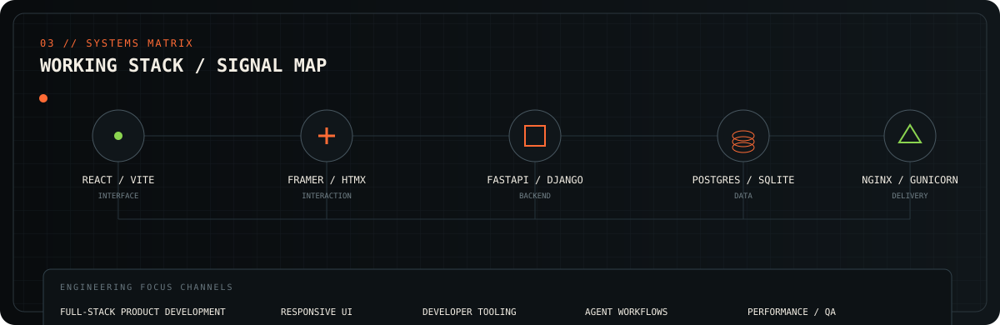
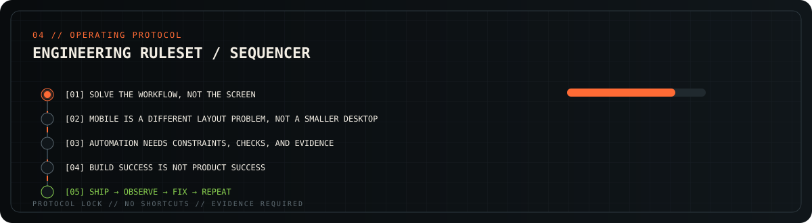
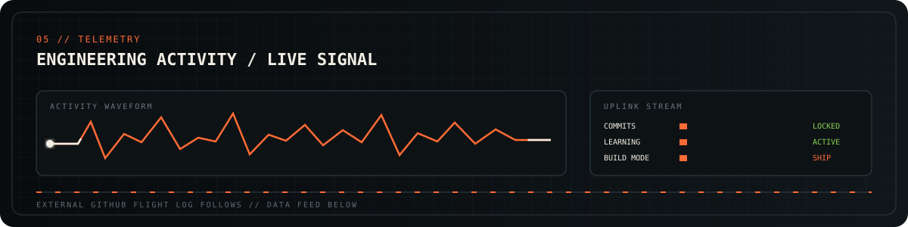

  

 

  <a href="https://gurtejbirsingh.vercel.app/"><b>PORTFOLIO ↗</b></a>
  &nbsp;&nbsp;•&nbsp;&nbsp;
  <a href="https://github.com/Gurtejhundal?tab=repositories"><b>ALL REPOSITORIES ↗</b></a>

 

  <a href="https://github.com/Gurtejhundal/Roadmap-Tracer">ROADMAP TRACER</a>
  &nbsp;•&nbsp;
  <a href="https://github.com/Gurtejhundal/VibeMaxing">WEBSITE AGENT SKILLS</a>
  &nbsp;•&nbsp;
  <a href="https://github.com/Gurtejhundal/BKJH">BIBI KAULAN JI HOSPITAL</a>
  &nbsp;•&nbsp;
  <a href="https://github.com/Gurtejhundal/DSA_400_Days_Challenge">DSA 400 DAYS</a>

 

 

 

 

  <code>MISSION CONTROL // BUILD USEFUL THINGS // KEEP THE SIGNAL CLEAN</code>

