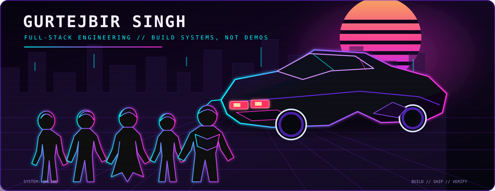

<!-- Profile README -->

<div align="center">
  <a href="https://gurtejbirsingh.vercel.app/">
    
  </a>
</div>

<br />

<div align="center">

**Full-stack developer building product-focused web software and AI-assisted engineering tools.**

[**Portfolio ↗**](https://gurtejbirsingh.vercel.app/) · [**All repositories ↗**](https://github.com/Gurtejhundal?tab=repositories)

</div>

---

## Building now

### [Roadmap Tracer](https://github.com/Gurtejhundal/Roadmap-Tracer)
A full-stack roadmap workspace for importing learning plans and actually following them.

- Imports pasted roadmaps, DOCX, Markdown, JSON, CSV, YAML, text files, and readable-text PDFs
- Parses common roadmap formats into sections, timeframes, and tasks
- Tracks completion progress and supports editing, search, navigation, and export
- Built with **React, Vite, FastAPI, SQLAlchemy, Pydantic, SQLite/PostgreSQL, and Framer Motion**

### [Website Agent Skills](https://github.com/Gurtejhundal/VibeMaxing)
A modular operating system of **24 specialist AI-agent skills** and **8 workflows** for serious website engineering.

- Covers design systems, mobile reconstruction, motion, performance, accessibility, QA, SEO, and deployment verification
- Uses explicit triggers, inspection steps, acceptance criteria, and handoffs instead of vague “make it better” prompting
- Built around a disciplined flow: **Inspect → Diagnose → Implement → Test → Verify**

### [DSA 400 Days Challenge](https://github.com/Gurtejhundal/DSA_400_Days_Challenge)
My long-form repository for consistent data-structures and algorithms practice.

---

## Toolkit

**Frontend**  
`React` · `Vite` · `React Router` · `Framer Motion`

**Backend**  
`Python` · `FastAPI` · `SQLAlchemy` · `Pydantic`

**Data**  
`SQLite` · `PostgreSQL`

**Engineering focus**  
`Full-stack product development` · `AI-agent tooling` · `Responsive interfaces` · `Developer tools` · `Workflow design`

---

## How I approach projects

```text
Understand the problem
        ↓
Design the system
        ↓
Build the smallest useful version
        ↓
Test the real interaction
        ↓
Refine the weak parts
        ↓
Ship something people can actually use
```

I care more about **clear product thinking, reliable behavior, and polished execution** than filling repositories with demos that do not solve anything.

---

## Explore

- **Portfolio:** [gurtejbirsingh.vercel.app](https://gurtejbirsingh.vercel.app/)
- **Projects:** [github.com/Gurtejhundal?tab=repositories](https://github.com/Gurtejhundal?tab=repositories)

<sub>Always building. Always tightening the gap between an idea and a usable product.</sub>
