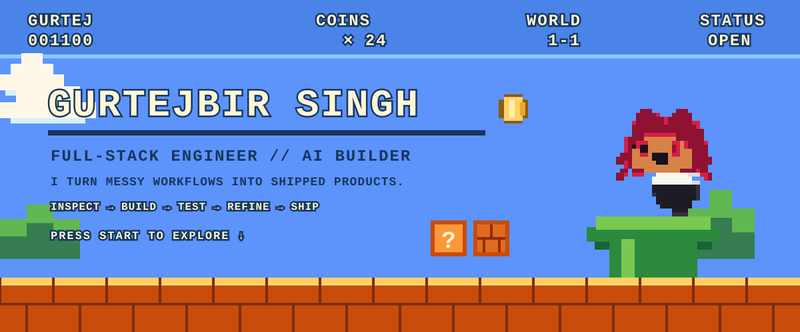
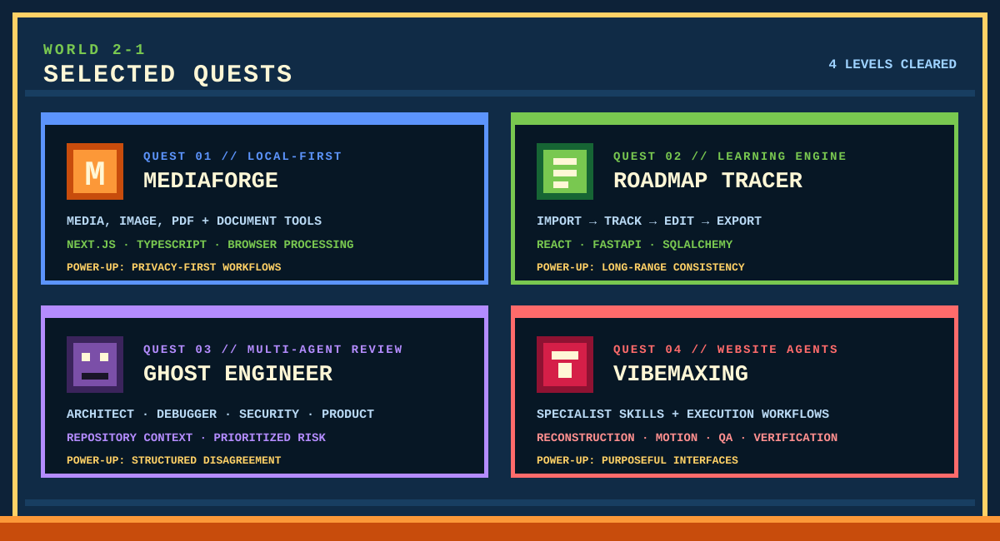
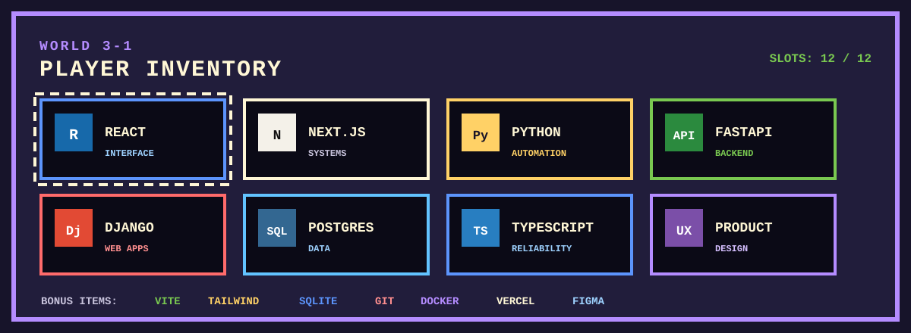
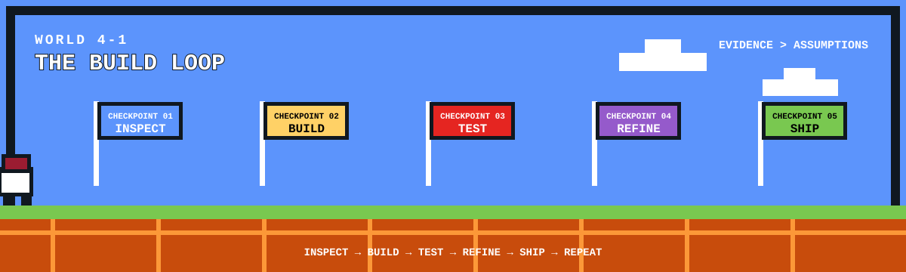
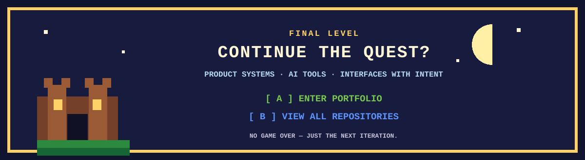

  

  <a href="https://gurtejbirsingh.vercel.app/"><b>[ START GAME — PORTFOLIO ]</b></a>
  &nbsp;&nbsp;•&nbsp;&nbsp;
  <a href="https://github.com/Gurtejhundal?tab=repositories"><b>[ LEVEL SELECT — REPOSITORIES ]</b></a>

  
  <h3>PLAYER 01 // GURTEJBIR SINGH</h3>
  
<code>CLASS</code> Full-stack engineer + AI builder

  
<code>FOCUS</code> Product systems · developer tools · local-first software · purposeful interfaces

  
<code>CURRENT QUEST</code> Deeper systems · stronger product execution · consistent DSA practice

  
<code>BUILD LOOP</code> Inspect → Build → Test → Refine → Ship

 

  <a href="https://github.com/Gurtejhundal/MediaForge"><b>[ MEDIAFORGE ]</b></a>
  &nbsp;•&nbsp;
  <a href="https://github.com/Gurtejhundal/Roadmap-Tracer"><b>[ ROADMAP TRACER ]</b></a>
  &nbsp;•&nbsp;
  <a href="https://github.com/Gurtejhundal/Ghost-Engineer"><b>[ GHOST ENGINEER ]</b></a>
  &nbsp;•&nbsp;
  <a href="https://github.com/Gurtejhundal/VibeMaxing"><b>[ VIBEMAXING ]</b></a>

 

 

 

  <h3>WORLD 5-1 // PAC-MAN CONTRIBUTION RUN</h3>
  
<code>LIVE MAP</code> Each pellet is powered by real GitHub contribution activity.

  <a href="https://github.com/Gurtejhundal">
    <picture>
      <source media="(prefers-color-scheme: dark)" srcset="https://raw.githubusercontent.com/Gurtejhundal/Gurtejhundal/output/pacman-contribution-graph-dark.svg" />
      <source media="(prefers-color-scheme: light)" srcset="https://raw.githubusercontent.com/Gurtejhundal/Gurtejhundal/output/pacman-contribution-graph.svg" />
      
    </picture>
  </a>
  
<code>AUTO-SAVES DAILY // CONTRIBUTIONS BECOME PELLETS // KEEP THE STREAK ALIVE</code>

  

  <a href="https://gurtejbirsingh.vercel.app/"><b>[ A — ENTER PORTFOLIO ]</b></a>
  &nbsp;&nbsp;•&nbsp;&nbsp;
  <a href="https://github.com/Gurtejhundal?tab=repositories"><b>[ B — ALL REPOSITORIES ]</b></a>

<code>PLAYER 01 READY // BUILD USEFUL THINGS // KEEP MOVING RIGHT</code>

