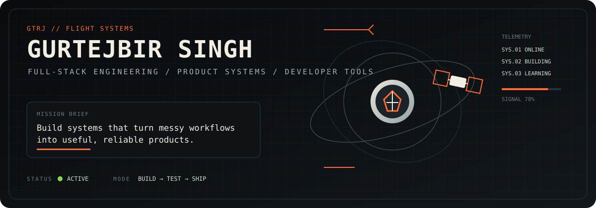

<div align="center">
  <a href="https://gurtejbirsingh.vercel.app/">
    
  </a>
</div>

<br/>

## 01 // FLIGHT DECK

**Full-stack engineer building product systems, developer tools, and interfaces that make complicated workflows easier to use.**

I am most interested in work where frontend craft, backend structure, and product thinking have to meet. I would rather ship one coherent system than ten disconnected demos.

[**PORTFOLIO ↗**](https://gurtejbirsingh.vercel.app/) · [**ALL REPOSITORIES ↗**](https://github.com/Gurtejhundal?tab=repositories)

```text
CURRENT VECTOR

01  understand the real problem
02  reduce it to a workable system
03  build the smallest useful version
04  test the actual interaction
05  refine the weak points
06  ship
```

---

## 02 // FEATURED SYSTEMS

| System | Mission | Stack / Focus |
|---|---|---|
| **[Roadmap Tracer](https://github.com/Gurtejhundal/Roadmap-Tracer)** | Turns long learning roadmaps and uploaded documents into structured, trackable plans with sections, tasks, progress, editing, search, navigation, and export. | React · Vite · FastAPI · SQLAlchemy · Pydantic · SQLite/PostgreSQL · Framer Motion |
| **[Website Agent Skills](https://github.com/Gurtejhundal/VibeMaxing)** | A modular framework of **24 specialist AI-agent skills** and **8 workflows** for design, responsive engineering, motion, accessibility, QA, SEO, performance, and deployment verification. | Agent workflows · Web engineering · QA · Design systems |
| **[Bibi Kaulan Ji Hospital](https://github.com/Gurtejhundal/BKJH)** | Production-oriented hospital website with admin-controlled content, appointment request tracking, protected staff workflow, and deployment configuration. | Python · Django · PostgreSQL · HTMX · Alpine.js · Gunicorn · Nginx |
| **[DSA 400 Days Challenge](https://github.com/Gurtejhundal/DSA_400_Days_Challenge)** | Long-form data-structures and algorithms practice repository focused on consistency and documented problem solving. | DSA · Problem solving · Python |

---

## 03 // SYSTEMS I WORK WITH

**Interface**  
`React` · `Vite` · `React Router` · `Framer Motion` · `HTMX` · `Alpine.js`

**Backend**  
`Python` · `FastAPI` · `Django` · `SQLAlchemy` · `Pydantic`

**Data / Delivery**  
`PostgreSQL` · `SQLite` · `Gunicorn` · `Nginx`

**Engineering focus**  
`Full-stack product development` · `Responsive UI` · `Developer tooling` · `Agent workflows` · `Performance` · `QA`

---

## 04 // OPERATING PRINCIPLES

```text
[01] SOLVE THE WORKFLOW, NOT THE SCREEN
[02] MOBILE IS A DIFFERENT LAYOUT PROBLEM, NOT A SMALLER DESKTOP
[03] AUTOMATION NEEDS CONSTRAINTS, CHECKS, AND EVIDENCE
[04] BUILD SUCCESS IS NOT PRODUCT SUCCESS
[05] SHIP → OBSERVE → FIX → REPEAT
```

---

## 05 // TELEMETRY

<a href="https://github.com/Gurtejhundal">
  
</a>

---

<div align="center">
  <sub><code>MISSION CONTROL // BUILD USEFUL THINGS // KEEP THE SIGNAL CLEAN</code></sub>
</div>
